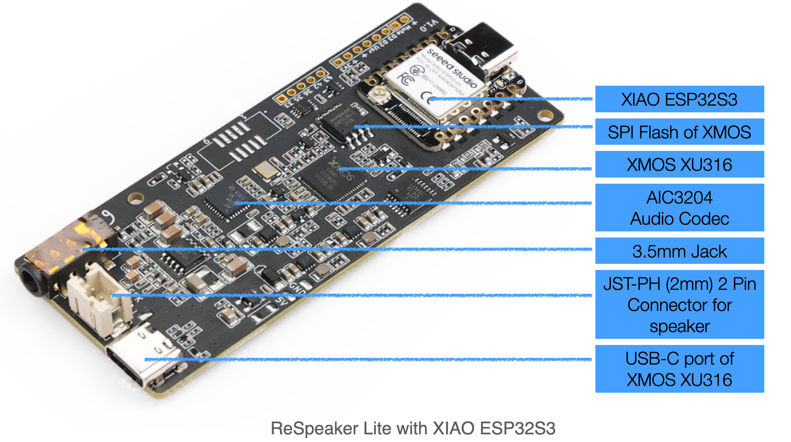

# ReSpeaker Lite

Powered by XMOS XU316 AI Sound and Audio chipset, this dev board excels in audio processing with its integrated dual microphone array, ideal for speech recognition and voice control. Featuring advanced onboard audio front-end algorithms, the XU316 chip provides interference cancellation, echo cancellation, and noise suppression. It supports **I2S** and **USB** connections and is compatible with Seeed Studio XIAO ESP32S3 (Sense), Adafruit QT Py, Raspberry Pi, and PC.

## Latest XMOS Firmware

The Respeaker Lite provides two types of XMOS firmware: I2S firmware and USB firmware. Regardless of whether it comes with XIAO ESP32S3, both firmware types can be used. When using the USB firmware, the Respeaker Lite receives and outputs audio data through the USB interface, essentially acting as a USB sound card that can record and play audio at the same time. When using the I2S firmware, the Respeaker Lite receives and outputs audio data through the I2S interface. In this scenario, users can easily obtain high-quality far-field recordings with a host MCU (e.g., XIAO ESP32S3), and build their speech recognition and voice assistant applications quickly.

If you are new to update XMOS firmware, please refer to our [DFU guide](./xmos_firmwares/dfu_guide.md).

**Releases and [Change Logs](./xmos_firmwares/changelog.md):**
- USB Firmware: [v2.0.7](./xmos_firmwares/respeaker_lite_usb_dfu_firmware_v2.0.7.bin)
- I2S Firmware: [v1.0.9](./xmos_firmwares/respeaker_lite_i2s_dfu_firmware_v1.0.9.bin)
- USB 48K Firmware: TODO
- I2S 48K Firmware: TODO
- [Older versions](./xmos_firmwares/)

## I2C interface of ReSpeaker Lite (only supported by I2S Firmware)

ReSpeaker Lite supports XMOS [Command Transport Protocol](https://www.xmos.com/documentation/XM-014785-PC/html/modules/rtos/doc/programming_guide/reference/rtos_services/device_control/device_control_protocol.html#) over I2C. In this Protocol, the Resource ID is an 8-bit identifier that identifies the resource within the device that the command is for. Currently, there are 2 Resource ID(RESID): 240(0xF0) and 241(0xF1) supported by ReSpeaker Lite.

The I2C address of ReSpeaker Lite is `0x42`. Its `D4` pin is `SDA` and `D5` pin is `SCL`.

### RESID 240(0xF0): I2C DFU service

- [Raspberry Pi as host device](https://github.com/xmos/host_xvf_control/tree/release/v3.0.0)

- [XIAO ESP32S3 as host device](https://github.com/esphome/home-assistant-voice-pe/blob/dev/esphome/components/voice_kit/voice_kit.cpp)

### RESID 241(0xF1): Configuration service

- [Arduino example of reading register](./xiao_esp32s3_arduino_examples/xiao_i2c_get_register_value/xiao_i2c_get_register_value.ino)

- [Arduino example of writing register](./xiao_esp32s3_arduino_examples/xiao_i2c_write_register_value/xiao_i2c_write_register_value.ino)

Note: 
- Learn more about the XMOS VNR value: [here](https://www.xmos.com/documentation/XM-014785-PC/html/modules/voice/modules/lib_vnr/doc/src/overview.html)

## Audio Codec on ReSpeaker Lite

[TLV320AIC3204](https://www.ti.com/product/TLV320AIC3204) is the audio codec of Respeaker Lite, which is primarily used for playing sound through the 3.5mm jack or the speaker. This audio codec can be configured via I2C, and it shares the same I2C bus with the XMOS XU316 and XIAO ESP32S3, with an I2C address of `0x18`. Here is an example of configuring the output volume with XIAO ESP32S3:

- [Arduino example of volume control](./xiao_esp32s3_arduino_examples/xiao_i2c_control_volume/xiao_i2c_control_volume.ino)
- [TLV320AIC3204 Application Reference Guide](https://www.ti.com/lit/ml/slaa557/slaa557.pdf?ts=1729537291311)

## Use ReSpeaker Lite with XIAO ESP32S3

- [Arduino examples](./xiao_esp32s3_arduino_examples)

- [ESPHome yaml examples(TODO)](./esphome_yaml)

## DIY

### Pin Out

