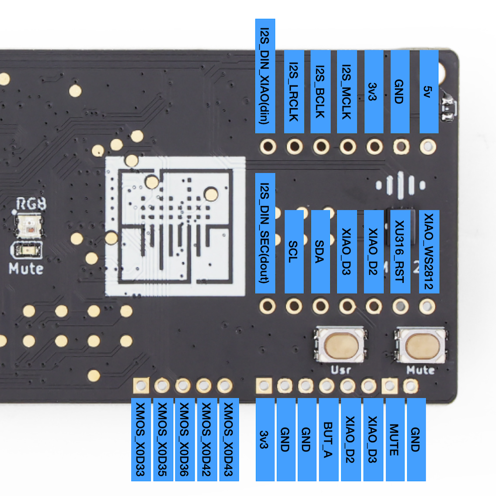

# ReSpeaker Lite

Powered by XMOS XU316 AI Sound and Audio chipset, this dev board excels in audio processing with its integrated dual microphone array, ideal for speech recognition and voice control. Featuring advanced onboard NLU algorithms, the XU316 chip provides interference cancellation, echo cancellation, and noise suppression. It supports **I2S** and **USB** connections and is compatible with Seeed Studio XIAO ESP32S3 (Sense), Adafruit QT Py, Raspberry Pi, and PC.

## Latest XMOS Firmware

[Change Log](./xmos_firmwares/changelog.md)

- USB DFU Firmware: [v2.0.7](./xmos_firmwares/respeaker_lite_usb_dfu_firmware_v2.0.7.bin)
- I2S DFU Firmware: [v1.0.9](./xmos_firmwares/respeaker_lite_i2s_dfu_firmware_v1.0.9.bin)
- USB 48K: TODO
- I2S 48K: TODO

## Use with XIAO ESP32S3

[Arduino examples](./xiao_esp32s3_examples)

[ESPHome examples(TODO)](./esphome_yaml)

## DIY

### Pin Out

