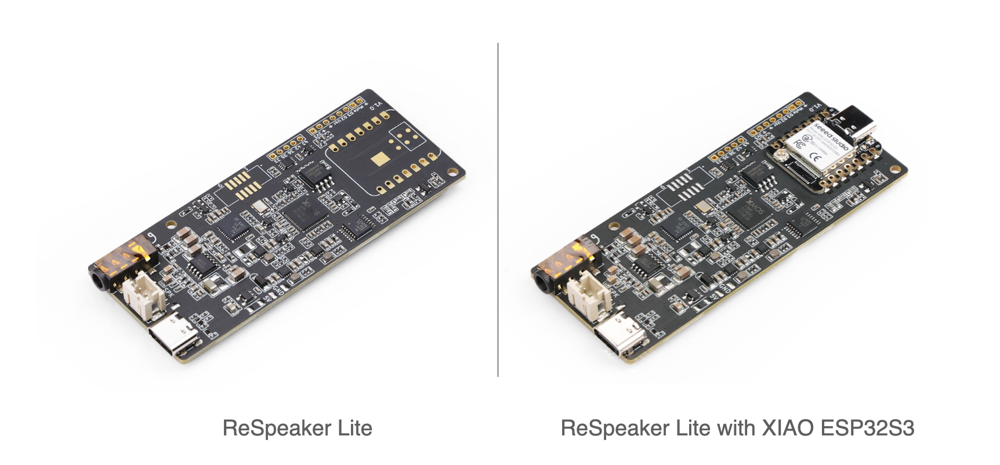
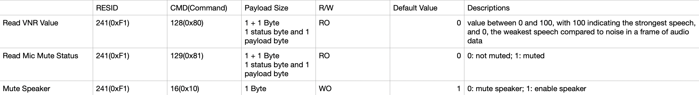

# ReSpeaker Lite

Powered by XMOS XU316 AI Sound and Audio chipset, this dev board excels in audio processing with its integrated dual microphone array, ideal for speech recognition and voice control. Featuring advanced onboard NLU algorithms, the XU316 chip provides interference cancellation, echo cancellation, and noise suppression. It supports **I2S** and **USB** connections and is compatible with Seeed Studio XIAO ESP32S3 (Sense), Adafruit QT Py, Raspberry Pi, and PC.

## Latest XMOS Firmware

[Change Log](./xmos_firmwares/changelog.md)

- USB DFU Firmware: [v2.0.7](./xmos_firmwares/respeaker_lite_usb_dfu_firmware_v2.0.7.bin)
- I2S DFU Firmware: [v1.0.9](./xmos_firmwares/respeaker_lite_i2s_dfu_firmware_v1.0.9.bin)
- USB 48K: TODO
- I2S 48K: TODO

## I2C interface of ReSpeaker Lite (only supported by I2S Firmware)

ReSpeaker Lite supports XMOS [Command Transport Protocol](https://www.xmos.com/documentation/XM-014785-PC/html/modules/rtos/doc/programming_guide/reference/rtos_services/device_control/device_control_protocol.html#) over I2C. In this Protocol, the Resource ID is an 8-bit identifier that identifies the resource within the device that the command is for. Currently, there are 2 Resource ID(RESID): 240(0xF0) and 241(0xF1) supported by ReSpeaker Lite.

The I2C address of ReSpeaker Lite is `0x42`. Its `D4` pin is `SDA` and `D5` pin is `SCL`.

### RESID 240(0xF0): I2C DFU service

- [Raspberry Pi as host device](https://github.com/xmos/host_xvf_control/tree/release/v3.0.0)

- [XIAO ESP32S3 as host device](https://github.com/esphome/home-assistant-voice-pe/blob/dev/esphome/components/voice_kit/voice_kit.cpp)

### RESID 241(0xF1): Configuration service

- [Arduino example of reading register](./xiao_esp32s3_arduino_examples/xiao_i2c_get_register_value/xiao_i2c_get_register_value.ino)

- [Arduino example of writing register](./xiao_esp32s3_arduino_examples/xiao_i2c_write_register_value/xiao_i2c_write_register_value.ino)

Note: 
- Learn more about the XMOS VNR value: [here](https://www.xmos.com/documentation/XM-014785-PC/html/modules/voice/modules/lib_vnr/doc/src/overview.html)

## Use ReSpeaker Lite with XIAO ESP32S3

[Arduino examples](./xiao_esp32s3_arduino_examples)

[ESPHome examples(TODO)](./esphome_yaml)

## DIY

### Pin Out

