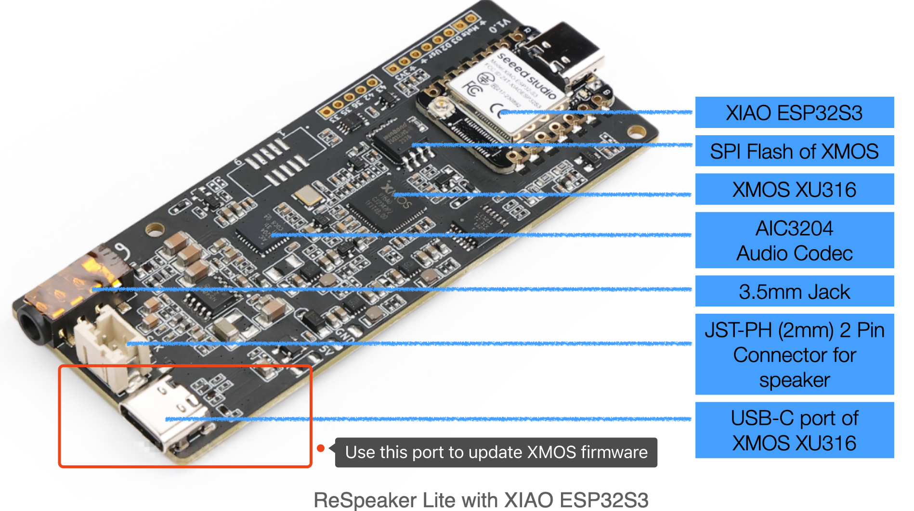
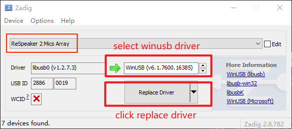
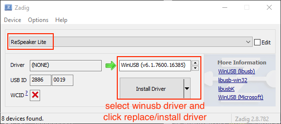
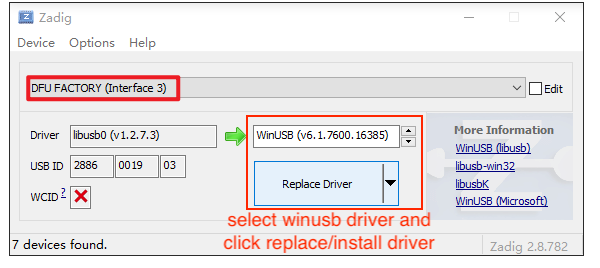
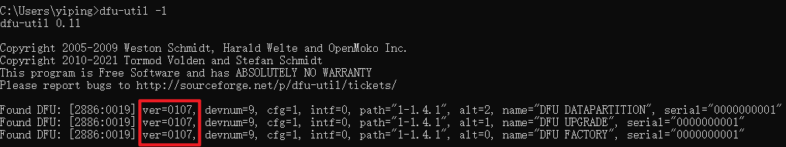
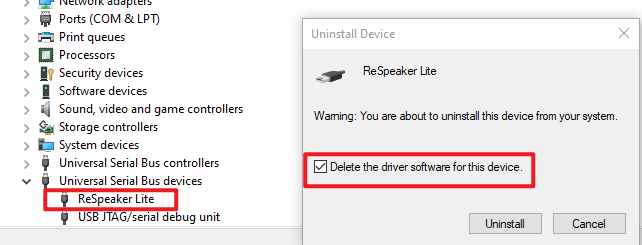

# XMOS XU316 DFU Guide

## 1. Wring

Connect the ReSpeaker Lite Board to your PC via the USB cable. Note that you need to use the XMOS USB-C port(close to 3.5mm jack port) to flash XMOS’s firmware.





## 2. Install DFU Util

[dfu-util](http://dfu-util.sourceforge.net/) is a command line tool for Device Firmware Upgrade via USB port.

### On Windows

- Download [dfu-util-0.11-binaries.tar.xz](https://dfu-util.sourceforge.net/releases/dfu-util-0.11-binaries.tar.xz) and extract it to your local system, e.g., `D:\`

- Change directory to the `dfu-util.exe`, e.g., `D:\dfu-util-0.11-binaries\win64\`(if you are using win32, please change win64 to win32)

- Append the path of the `dfu-util.exe` to the system environment variable Path: "My Computer" > "Properties" > "Advanced" > "Environment Variables" > "Path". Please note that paths in the variable `Path` are seperated by semicolon `;`. This will allow dfu-util to be executed globally in command prompt.

- Open the start menu and type `cmd`. Press the enter key. In the terminal that comes up, check if `dfu-util.exe` path is set with `dfu-util -V` command:
```
C:\Users\yiping>dfu-util -V
dfu-util 0.11

Copyright 2005-2009 Weston Schmidt, Harald Welte and OpenMoko Inc.
Copyright 2010-2021 Tormod Volden and Stefan Schmidt
This program is Free Software and has ABSOLUTELY NO WARRANTY
Please report bugs to http://sourceforge.net/p/dfu-util/tickets/

```

- Run `dfu-util -l` to check if ReSpeaker Lite is detected: 
```
C:\Users\yiping>dfu-util -l
dfu-util 0.11

Copyright 2005-2009 Weston Schmidt, Harald Welte and OpenMoko Inc.
Copyright 2010-2021 Tormod Volden and Stefan Schmidt
This program is Free Software and has ABSOLUTELY NO WARRANTY
Please report bugs to http://sourceforge.net/p/dfu-util/tickets/

Found DFU: [2886:0019] ver=0205, devnum=9, cfg=1, intf=0, path="1-1.4.1", alt=2, name="DFU DATAPARTITION", serial="0000000001"
Found DFU: [2886:0019] ver=0205, devnum=9, cfg=1, intf=0, path="1-1.4.1", alt=1, name="DFU UPGRADE", serial="0000000001"
Found DFU: [2886:0019] ver=0205, devnum=9, cfg=1, intf=0, path="1-1.4.1", alt=0, name="DFU FACTORY", serial="0000000001"
```
**If you get a "Cannot open DFU device" error like this, please keep following this step. If not, please go to Step 3 to flash firmware.**
```
C:\Users\yiping>dfu-util -l
dfu-util 0.11

Copyright 2005-2009 Weston Schmidt, Harald Welte and OpenMoko Inc.
Copyright 2010-2021 Tormod Volden and Stefan Schmidt
This program is Free Software and has ABSOLUTELY NO WARRANTY
Please report bugs to http://sourceforge.net/p/dfu-util/tickets/

Cannot open DFU device 2886:0019 found on devnum 9 (LIBUSB_ERROR_NOT_SUPPORTED)
```
- Install [Zadig](https://zadig.akeo.ie/) and open it. Click "Options"->"List All Devices".

- Find "ReSpeaker 2 Mics Array" or "ReSpeaker Lite" or "DFU FACTORY (Interface 3)" from the device list, install `WINUSB v6.x.xxxx.xxxxx` driver. 





- After installation is completed(that will take a few minutes), please do power-cycle and run `dfu-util -l` again, ReSpeaker Lite should be detected right now


### On macOS

- Install dfu-util with [brew](https://brew.sh/): `brew install dfu-util`

- Run `dfu-util -l` to check if ReSpeaker Lite is detected: 
```
➜  ~ dfu-util -l
dfu-util 0.11

Copyright 2005-2009 Weston Schmidt, Harald Welte and OpenMoko Inc.
Copyright 2010-2021 Tormod Volden and Stefan Schmidt
This program is Free Software and has ABSOLUTELY NO WARRANTY
Please report bugs to http://sourceforge.net/p/dfu-util/tickets/

Found DFU: [2886:0019] ver=0205, devnum=1, cfg=1, intf=3, path="1-1", alt=2, name="DFU DATAPARTITION", serial="0000000001"
Found DFU: [2886:0019] ver=0205, devnum=1, cfg=1, intf=3, path="1-1", alt=1, name="DFU UPGRADE", serial="0000000001"
Found DFU: [2886:0019] ver=0205, devnum=1, cfg=1, intf=3, path="1-1", alt=0, name="DFU FACTORY", serial="0000000001"
```


### On Linux

- Install dfu-util with apt: `sudo apt install dfu-util`

- Run `sudo dfu-util -l` to check if ReSpeaker Lite is detected: 

```
pi@raspberrypi:~ $ sudo dfu-util -l
dfu-util 0.9

Copyright 2005-2009 Weston Schmidt, Harald Welte and OpenMoko Inc.
Copyright 2010-2016 Tormod Volden and Stefan Schmidt
This program is Free Software and has ABSOLUTELY NO WARRANTY
Please report bugs to http://sourceforge.net/p/dfu-util/tickets/

Found DFU: [2886:0019] ver=0205, devnum=5, cfg=1, intf=3, path="1-1.1", alt=2, name="DFU DATAPARTITION", serial="0000000001"
Found DFU: [2886:0019] ver=0205, devnum=5, cfg=1, intf=3, path="1-1.1", alt=1, name="DFU UPGRADE", serial="0000000001"
Found DFU: [2886:0019] ver=0205, devnum=5, cfg=1, intf=3, path="1-1.1", alt=0, name="DFU FACTORY", serial="0000000001"
```

## 3. Flash Firmware

- Run the following command `dfu-util -R -e -a 1 -D /path/to/dfu_firmware.bin`:
    - On Linux please run `sudo dfu-util -R -e -a 1 -D /path/to/dfu_firmware.bin`
    - After flashing is completed, please restart the board

```
C:\Users\yiping>dfu-util -R -e -a 1 -D D:\Downloads\respeaker_lite_i2s_dfu_firmware_v1.0.7.bin
dfu-util 0.11

Copyright 2005-2009 Weston Schmidt, Harald Welte and OpenMoko Inc.
Copyright 2010-2021 Tormod Volden and Stefan Schmidt
This program is Free Software and has ABSOLUTELY NO WARRANTY
Please report bugs to http://sourceforge.net/p/dfu-util/tickets/

Warning: Invalid DFU suffix signature
A valid DFU suffix will be required in a future dfu-util release
Opening DFU capable USB device...
Device ID 2886:0019
Device DFU version 0101
Claiming USB DFU Interface...
Setting Alternate Interface #1 ...
Determining device status...
DFU state(2) = dfuIDLE, status(0) = No error condition is present
DFU mode device DFU version 0101
Device returned transfer size 4096
Copying data from PC to DFU device
Download        [=========================] 100%       270336 bytes
Download done.
DFU state(7) = dfuMANIFEST, status(0) = No error condition is present
DFU state(2) = dfuIDLE, status(0) = No error condition is present
Done!
Resetting USB to switch back to Run-Time mode
```

- Check the current firmware version on ReSpeaker Lite  `dfu-util -l`:



## 4. Can't detect ReSpeaker Lite USB sound card on Windows after flashing USB firmware?

- Open the start menu and type `Device manager`. Press the enter key. Find `ReSpeaker Lite` device, right click it and select `Uninstall device`. Select `Delete the driver software for this device` and click `Uninstall`. After that, restart the device and Windows will re-install the right sound card driver for it.

